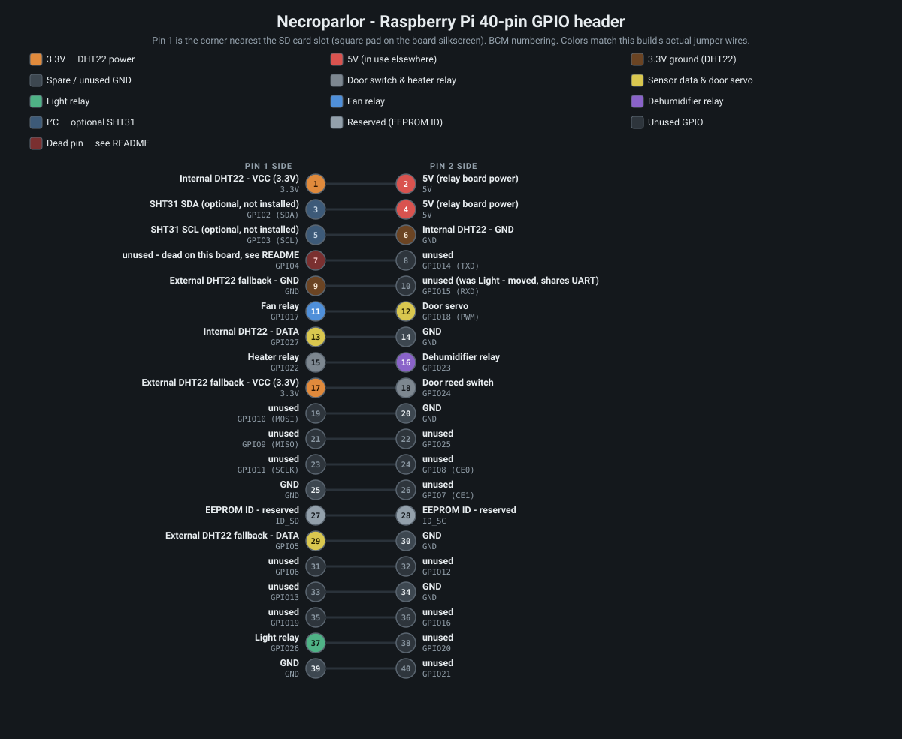

# Necroparlor

Raspberry Pi climate control for a dermestid beetle colony living in a converted chest freezer: temperature/humidity monitoring, heater/fan/dehumidifier control, a door-open safety light, an optional webcam, and a web dashboard.

**Starting a new session on this project? Read `PROJECT_STATUS.md` first** — it covers current state, the reasoning behind non-obvious design decisions, and open threads this README won't get into.

## Files

| File | Purpose |
|---|---|
| `climate.py` | Main control loop — heater, fan/vent servo, dehumidifier, door light. Always running. |
| `webapp.py` | Flask dashboard — live readings/history, mode switching, setpoints. |
| `shared_state.py` | Shared config + SQLite helpers used by every other script. Must live in the same folder. |
| `templates/` | Dashboard pages: `base.html` (nav/layout), `home.html`, `logs.html`, `data.html`, `config.html`, `timelapse.html`. |
| `config.json` | Current mode, setpoints, sensor/camera settings. Auto-created if missing. |
| `ble_listener.py` | Optional — listens for a BLE temp/humidity sensor (SensorPush, Govee, INKBIRD, Xiaomi, RuuviTag) as the external reading. |
| `ble_battery.py` | Optional — periodic battery check (SensorPush HT1 only; other brands broadcast battery for free). |
| `discover_ble_sensor.py` | One-time helper to find a BLE sensor's address. |
| `camera_service.py` | Optional — USB webcam live view + per-mode timelapse. |
| `discover_camera.py` | One-time helper to find the webcam's `/dev/videoN` index. |
| `auto_update.sh` | Pulls from git and restarts the affected services. |
| `systemd/` | Unit/timer files so everything runs on boot and restarts on crash. |

## Hardware / wiring



Diagram colors match the actual jumper wires in this build (see the in-image legend) — not a generic category scheme.

GPIO pin assignments (BCM numbering, set in `climate.py`):

| Function | BCM | Physical pin |
|---|---|---|
| Fan relay | GPIO17 | 11 |
| Door servo (PWM) | GPIO18 | 12 |
| Internal DHT22 — DATA | GPIO27 | 13 |
| Heater relay | GPIO22 | 15 |
| Dehumidifier relay | GPIO23 | 16 |
| Door reed switch | GPIO24 | 18 |
| External DHT22 fallback — DATA | GPIO5 | 29 |
| Light relay | GPIO26 | 37 |
| SHT31 SDA (optional) | GPIO2 | 3 |
| SHT31 SCL (optional) | GPIO3 | 5 |

**GPIO4 (physical pin 7)** is dead on this specific board (confirmed via `pinctrl` — see `PROJECT_STATUS.md`) and is not used; the external fallback probe was moved to GPIO5 instead. **GPIO15/RXD** is avoided for the same reason it's marked unused above — it doubles as UART0 RXD and misbehaves if the serial console is enabled.

If `PIN_*` in `climate.py` ever changes again, regenerate the diagram with `python3 docs/gen_gpio_pinout.py` after updating its `ROWS` table to match.

### Internal sensor: DHT22/AM2302 (default) or SHT31 (optional)

| DHT22/AM2302 pin | Pi pin |
|---|---|
| VCC | 3.3V (pin 1) |
| GND | GND (pin 6) |
| DATA | GPIO27 (pin 13) |

Wired to 3.3V rather than 5V because both 5V pins are already committed to relay board power — the DHT22 tolerates 3.3–5.5V, so this is just a wiring choice, not a workaround. Add a 4.7–10kΩ pull-up between DATA and VCC if using a bare chip (most breakout modules already have one).

To use an SHT31 instead (drop-in swap, no code changes — flip "Internal sensor source" on the Config page):

```bash
sudo raspi-config   # Interface Options -> I2C -> Enable, then reboot
```

| SHT31 pin | Pi pin |
|---|---|
| VIN | 3.3V (pin 1) |
| GND | GND (pin 6) |
| SCL | GPIO3 (pin 5) |
| SDA | GPIO2 (pin 3) |

The SHT31 also has an onboard heater `climate.py` uses to recover from condensation (>99% humidity for a minute triggers a 10s heater pulse, rate-limited to once/10min) — the DHT22 has no equivalent.

### External sensor: BLE primary + wired fallback

The external reading comes from a BLE sensor (primary) and a wired DHT22 on GPIO5 (always-on fallback). `climate.py` reads both every cycle and automatically uses whichever is fresher (BLE within 90s, otherwise the wired probe) — no manual switching, and every failover is logged.

| DHT22/AM2302 pin | Pi pin |
|---|---|
| VCC | 3.3V (pin 17) |
| GND | GND (pin 9 or similar) |
| DATA | GPIO5 (pin 29) |

## Install

```bash
sudo apt update
sudo apt install python3-pip python3-rpi.gpio
pip3 install flask adafruit-circuitpython-dht adafruit-circuitpython-sht31d --break-system-packages
```

Copy this whole folder to the Pi, e.g. `/home/pi/dermestid/`.

## Run manually (for testing)

```bash
cd /home/pi/dermestid
python3 climate.py      # in one terminal
python3 webapp.py       # in another
```

Visit `http://<pi-ip-address>:8080`. **There's no login on this dashboard** — fine on your home network, don't port-forward it to the internet.

## BLE external sensor (optional)

```bash
pip3 install sensorpush-ble bleak --break-system-packages   # swap for your brand's package, e.g. govee-ble
```

Requires Python 3.11+ (default on current Raspberry Pi OS).

1. Find the sensor's address: `python3 discover_ble_sensor.py`, or use the Config page's External card **Discover** button (reads `ble_listener.py`'s own already-running scan — doesn't start a second one).
2. Set it on the Config page, or in `config.json`:
   ```json
   "ble_mac": "AA:BB:CC:DD:EE:FF",
   "ble_sensor_type": "sensorpush"
   ```
   Changing the brand auto-restarts `dermestid-ble.service` (needs the sudoers entry below).
3. Run it: `python3 ble_listener.py`

A brand not listed above is usually a small addition — look for a `<brand>-ble` package on PyPI (the same ecosystem Home Assistant's Bluetooth integrations use) and add an entry to `shared_state.BLE_SENSOR_LIBRARIES`.

**Battery check** (SensorPush HT1 only — other brands broadcast battery for free):
```bash
sudo cp systemd/dermestid-battery.service systemd/dermestid-battery.timer /etc/systemd/system/
sudo systemctl daemon-reload
sudo systemctl enable --now dermestid-battery.timer
```
Checks at most once/day; warns at 15% or below.

## Camera (optional)

```bash
pip3 install opencv-python-headless --break-system-packages
sudo apt install ffmpeg   # needed to compile timelapse sessions into .mp4
```

1. Find the device index: `python3 discover_camera.py`, or the Config page's Camera card **Discover** button (also shows each device's actually-supported resolutions, and briefly stops/restarts `dermestid-camera.service` so it can probe the device — needs the sudoers `stop`/`start` lines below).
2. Set it on the Config page, or in `config.json`:
   ```json
   "camera": {
     "device": "0",
     "width": 1280,
     "height": 720,
     "jpeg_quality": 80,
     "live_capture_fps": 5,
     "stream_relay_fps": 7
   }
   ```
   A device/resolution change auto-restarts `dermestid-camera.service`. `live_capture_fps` is how often a frame is grabbed from the USB device; `stream_relay_fps` is how often the dashboard re-sends the latest frame to each open browser tab — both take effect within a cycle, no restart needed. Watch the header's Pi temp/load/disk-free readout while raising either, since the Pi shares its CPU with `climate.py`.
3. Run it: `python3 camera_service.py`

```bash
sudo cp systemd/dermestid-camera.service /etc/systemd/system/
sudo systemctl daemon-reload
sudo systemctl enable --now dermestid-camera.service
```

**Live view** (Home page) is a genuine MJPEG stream, not a slideshow — a 💡 icon overlaid on it toggles the enclosure light for 5 minutes (auto-expires; the physical door switch always overrides it). **Timelapse** (its own page) auto-compiles each mode session's frames into an `.mp4` once it ends; set `snapshot_interval_minutes` per mode on the Config page (`0` = off). A hardcoded safety net prunes the oldest snapshots if free disk space drops below 200MB.

## Run permanently (recommended)

```bash
sudo cp systemd/*.service /etc/systemd/system/
sudo systemctl daemon-reload
sudo systemctl enable --now dermestid-climate.service
sudo systemctl enable --now dermestid-web.service
sudo systemctl enable --now dermestid-ble.service       # only if using a BLE sensor
sudo systemctl enable --now dermestid-battery.timer      # optional
sudo systemctl enable --now dermestid-camera.service     # only if using a webcam
```

```bash
systemctl status dermestid-climate.service
journalctl -u dermestid-climate.service -f
tail -f /home/pi/dermestid/logs/climate.log
```

Unit files assume `/home/pi/dermestid` and user `pi` — edit `WorkingDirectory`/`ExecStart`/`User` if yours differs.

## Automatic updates

`webapp.py` checks GitHub every 15 minutes (configurable) and shows a banner with an **Update now** button when a commit is waiting — read-only until you click it. The Config page's branch dropdown lets you track something other than `main` for testing.

Applying an update (via the button, or the fully-hands-off timer below) restarts services without anyone there to type a password, so it needs a one-time setup:

```bash
sudo visudo -f /etc/sudoers.d/dermestid
```
```
pi ALL=(root) NOPASSWD: /usr/bin/systemctl restart dermestid-climate.service
pi ALL=(root) NOPASSWD: /usr/bin/systemctl restart dermestid-web.service
pi ALL=(root) NOPASSWD: /usr/bin/systemctl restart dermestid-ble.service
pi ALL=(root) NOPASSWD: /usr/bin/systemctl restart dermestid-camera.service
pi ALL=(root) NOPASSWD: /usr/bin/systemctl stop dermestid-camera.service
pi ALL=(root) NOPASSWD: /usr/bin/systemctl start dermestid-camera.service
```
(Run `which systemctl` first — the path must match exactly.)

```bash
chmod +x auto_update.sh
```

That's it — "Update now" runs `auto_update.sh` as a detached background process so it survives `dermestid-web.service` restarting itself partway through.

**Fully automatic** (no button, checks/applies every 5 minutes on its own):
```bash
sudo cp systemd/dermestid-autoupdate.service systemd/dermestid-autoupdate.timer /etc/systemd/system/
sudo systemctl daemon-reload
sudo systemctl enable --now dermestid-autoupdate.timer
```

Local `config.json` changes are stashed before pulling and restored after (a warning is logged if that ever conflicts). Anything pushed to your GitHub repo can end up running on the Pi within the check interval.

## Dashboard pages

- **Home** (`/`) — live readings, relay states, mode switch, live camera view, and the temp/humidity history graph (1h–30d).
- **Logs** (`/logs`) — event log with level filter and pagination.
- **Data** (`/data`) — raw readings table, one row per control cycle, every column as stored.
- **Timelapse** (`/timelapse`) — compiled per-session videos.
- **Config** (`/config`) — per-mode setpoints, sensor source/calibration, BLE and camera settings, software updates.

## Activity modes

| Mode | Behavior |
|---|---|
| **Dormant** | Lower temp band (55–60°F default) — slows the colony down. |
| **Ready** | Warmer/humid band (78–85°F, 50% RH default) — active feeding/breeding. |
| **Cleaning** | Same as Ready, plus scheduled forced ventilation (default: 5 min every 30 min) to control odor. |

Defaults are a starting point, not a care sheet — tune from the dashboard based on how your colony responds.

## Safety behaviors (not configurable from the dashboard)

- No valid **internal** reading for 90s → everything forced off, alarm logged (no safe degraded mode without internal data).
- Losing the **external** reading only pauses thermal cooling — heating/dehumidifying/scheduled venting don't need it.
- Heater max continuous runtime: 20 min; fan: 60 min — each cuts off and locks out for 5 min if hit.
- Simultaneous heat + genuine cooling → cooling wins, heat skipped that cycle (the scheduled cleaning-mode vent is exempt — it's not a thermal decision).
- Readings that jump too far from the last accepted value in one cycle are rejected as glitches, with self-recovery if several consecutive rejections agree with each other (treated as a real sustained change, not noise).

These live as constants at the top of `climate.py` (and `camera_service.py`, for its own watchdog/disk-space thresholds) — edit and restart the service to change them.
