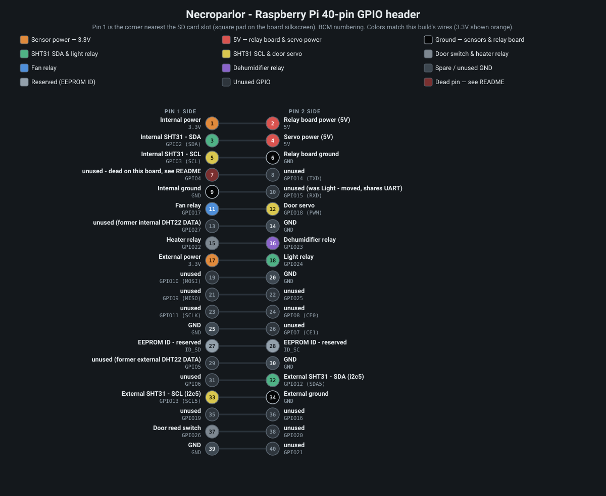

# Necroparlor

Raspberry Pi climate control for a dermestid beetle colony living in a converted chest freezer: temperature/humidity monitoring, heater/fan/dehumidifier control, a door-open safety light, an optional webcam, and a web dashboard.

**Starting a new session on this project? Read `PROJECT_STATUS.md` first** — it covers current state, the reasoning behind non-obvious design decisions, and open threads this README won't get into.

## Files

| File | Purpose |
|---|---|
| `climate.py` | Main control loop — heater, fan/vent servo, dehumidifier, door light. Always running. |
| `webapp.py` | Flask dashboard — live readings/history, mode switching, setpoints. |
| `shared_state.py` | Shared config + SQLite helpers used by every other script. Must live in the same folder. |
| `templates/` | Dashboard pages: `base.html` (nav/layout), `home.html`, `logs.html`, `data.html`, `config.html`, `timelapse.html`. |
| `config.json` | Current mode, setpoints, sensor/camera settings. Auto-created if missing. |
| `ble_listener.py` | Optional — listens for a BLE temp/humidity sensor (SensorPush, Govee, INKBIRD, Xiaomi, RuuviTag) as the external reading. |
| `ble_battery.py` | Optional — periodic battery check (SensorPush HT1 only; other brands broadcast battery for free). |
| `discover_ble_sensor.py` | One-time helper to find a BLE sensor's address. |
| `camera_service.py` | Optional — per-mode timelapse capture only (pulls snapshots from camera-streamer's HTTP API). Live view itself is served by camera-streamer, a separate daemon — see `docs/camera-streamer-setup.md`. |
| `discover_camera.py` | One-time helper to find the webcam's `/dev/videoN` index. |
| `auto_update.sh` | Pulls from git and restarts the affected services. |
| `systemd/` | Unit/timer files so everything runs on boot and restarts on crash. |

## Hardware / wiring



Diagram colors match the actual jumper wires in this build (see the in-image legend) — not a generic category scheme.

GPIO pin assignments (BCM numbering, set in `climate.py`):

| Function | BCM | Physical pin |
|---|---|---|
| Fan relay | GPIO17 | 11 |
| Door servo (PWM) | GPIO18 | 12 |
| Heater relay | GPIO22 | 15 |
| Dehumidifier relay | GPIO23 | 16 |
| Door reed switch | GPIO24 | 18 |
| Light relay | GPIO26 | 37 |
| Internal SHT31 SDA | GPIO2 | 3 |
| Internal SHT31 SCL | GPIO3 | 5 |
| External/fallback SHT31 SDA (i2c5) | GPIO12 | 32 |
| External/fallback SHT31 SCL (i2c5) | GPIO13 | 33 |

**GPIO4 (physical pin 7)** is dead on this specific board (confirmed via `pinctrl` — see `PROJECT_STATUS.md`) and is not used. **GPIO15/RXD** is avoided for the same reason it's marked unused above — it doubles as UART0 RXD and misbehaves if the serial console is enabled. GPIO27 and GPIO5 (physical pins 13/29) are free/unused — the old wired DHT22 probes that lived there have been retired in favor of two SHT31s (see "Sensors" below and `PROJECT_STATUS.md`).

If `PIN_*` in `climate.py` ever changes again, regenerate the diagram with `python3 docs/gen_gpio_pinout.py` after updating its `ROWS` table to match.

### Sensors: both internal and external are SHT31 (I2C)

This project originally supported wired DHT22/AM2302 probes as well (for both the internal sensor and the external wired fallback), with a config toggle to pick either one. That DHT22 support has since been removed — both physical sensors are now SHT31s, so `climate.py` always reads both sensors as SHT31. (If you ever need the DHT22 code back for reference, it's in git history before this change.)

```bash
sudo raspi-config   # Interface Options -> I2C -> Enable, then reboot
```

Internal SHT31 (hardware I2C1, the Pi's default I2C bus):

| Internal SHT31 pin | Pi pin |
|---|---|
| VIN | 3.3V (pin 1) |
| GND | GND (pin 6) |
| SCL | GPIO3 (pin 5) |
| SDA | GPIO2 (pin 3) |

Both SHT31s have an onboard heater `climate.py` uses to recover from condensation (>99% humidity for a minute triggers a 10s heater pulse, rate-limited to once/10min per sensor).

### External sensor: BLE primary + wired/local SHT31 fallback

The external reading comes from a BLE sensor (primary) and the second, local SHT31 (always-on backup). `climate.py` reads both every cycle and automatically uses whichever is fresher (BLE within 90s, otherwise the fallback probe) — no manual switching, and every failover is logged.

The fallback SHT31 needs its **own** I2C bus, separate from the internal sensor's: two SHT31 breakouts both default to address 0x44, so they can't share one bus. Rather than bit-banging a software bus, this uses the Pi 4/CM4's extra built-in hardware I2C controller (BCM2711 has more than just the one on GPIO2/3), enabled via the `i2c5` overlay — defaults to GPIO12/13, exposed to Linux as `/dev/i2c-5`:

```bash
# /boot/firmware/config.txt (or /boot/config.txt on older Raspberry Pi OS):
dtoverlay=i2c5
# then reboot
```

(`dtoverlay=i2c5,baudrate=50000` also works if you want a slower, more reliable bus — same as the main `i2c_arm_baudrate` setting, just scoped to this one. Pi 3 and earlier don't have this extra controller, so this overlay is Pi 4/400/CM4-only.)

| 2nd SHT31 pin | Pi pin |
|---|---|
| VIN | 3.3V (pin 1) |
| GND | GND (pin 6) |
| SCL | GPIO13 (pin 33) |
| SDA | GPIO12 (pin 32) |

This path also needs the `adafruit-extended-bus` package (see Install below) — Blinka's `busio.I2C` only auto-detects the board's *default* hardware I2C bus (board.SCL/board.SDA, GPIO2/3), not this second one, even though it's real hardware too - so this uses `adafruit_extended_bus.ExtendedI2C(5)` to open `/dev/i2c-5` directly instead.

If BOTH the BLE sensor and the fallback probe are down at the same time, that's logged as an `external_sensor_unavailable` event (visible on the Logs page and in `events.txt`) — unlike a *partial* outage (one of the two down, the other still covering for it), which is normal automatic failover and not something you need to react to.

## Install

```bash
sudo apt update
sudo apt install python3-pip python3-rpi.gpio
pip3 install flask adafruit-circuitpython-sht31d adafruit-extended-bus --break-system-packages
```

If you set a live-view/timelapse crop (see "Live view crop" on the Settings page), `camera_service.py` also needs Pillow to do the actual cropping:

```bash
pip3 install Pillow --break-system-packages
```

This is only imported when a crop is actually configured — with no crop set (the default), snapshots pass through uncropped and Pillow is never touched, so you can skip this unless you use that feature.

Copy this whole folder to the Pi, e.g. `/home/pi/dermestid/`.

## Run manually (for testing)

```bash
cd /home/pi/dermestid
python3 climate.py      # in one terminal
python3 webapp.py       # in another
```

Visit `http://<pi-ip-address>:8080`. **There's no login on this dashboard** — fine on your home network, don't port-forward it to the internet.

`webapp.py` runs as the unprivileged `pi` user (see the systemd unit below), so it can't bind port 80 directly - ports under 1024 need root, and running a Flask dev server as root just to shave a port number off the URL isn't worth it. If you'd rather not type `:8080` every time, redirect port 80 to it at the firewall level instead, which doesn't touch the app's own privileges at all:

```bash
sudo iptables -t nat -A PREROUTING -p tcp --dport 80 -j REDIRECT --to-port 8080
sudo apt-get install iptables-persistent   # answer "yes" to save current rules - this is what makes it survive a reboot
```

**[2026-09-17] CONFIRMED** - added on a real Pi and survived a reboot. This redirect happens at the network layer before anything about who's asking, so it also covers traffic arriving over a VPN like Tailscale, not just the LAN - `http://<pi-tailscale-ip>/` works with no port either, if you're using one.

## BLE external sensor (optional)

```bash
pip3 install sensorpush-ble bleak --break-system-packages   # swap for your brand's package, e.g. govee-ble
```

Requires Python 3.11+ (default on current Raspberry Pi OS).

1. Find the sensor's address: `python3 discover_ble_sensor.py`, or use the Config page's External card **Discover** button (reads `ble_listener.py`'s own already-running scan — doesn't start a second one).
2. Set it on the Config page, or in `config.json`:
   ```json
   "ble_mac": "AA:BB:CC:DD:EE:FF",
   "ble_sensor_type": "sensorpush"
   ```
   Changing the brand auto-restarts `dermestid-ble.service` (needs the sudoers entry below).
3. Run it: `python3 ble_listener.py`

A brand not listed above is usually a small addition — look for a `<brand>-ble` package on PyPI (the same ecosystem Home Assistant's Bluetooth integrations use) and add an entry to `shared_state.BLE_SENSOR_LIBRARIES`.

**Battery check** (SensorPush HT1 only — other brands broadcast battery for free):
```bash
sudo cp systemd/dermestid-battery.service systemd/dermestid-battery.timer /etc/systemd/system/
sudo systemctl daemon-reload
sudo systemctl enable --now dermestid-battery.timer
```
Checks at most once/day; warns at 15% or below.

## Camera (optional)

[2026-09-14] Live view is served by **camera-streamer** now, a separate
hardware-accelerated streaming daemon — not this project's own OpenCV
capture loop anymore. Full build/config walkthrough (including two
flags you'll need to confirm from `camera-streamer --help` on your own
Pi, since they weren't pinned down from documentation alone) is in
**[`docs/camera-streamer-setup.md`](docs/camera-streamer-setup.md)** —
follow that doc for the actual setup. Short version once it's built and
running:

```bash
sudo apt install ffmpeg   # needed to compile timelapse sessions into .mp4
```

1. Find the device index: `python3 discover_camera.py`, or the Config page's Camera card **Discover** button (also shows each device's actually-supported resolutions, and briefly stops/restarts `camera-streamer.service` so it can probe the device — needs the sudoers `stop`/`start` lines below).
2. Set device/resolution/port on the Config page, or in `config.json`:
   ```json
   "camera": {
     "device": "0",
     "width": 1280,
     "height": 720,
     "streamer_port": 8090
   }
   ```
   `streamer_port` can't be `8080` — that's this dashboard's own port. A save here regenerates `camera-streamer.env` and restarts `camera-streamer.service` automatically. JPEG quality and capture rate are camera-streamer's own CLI flags now (see `docs/camera-streamer-setup.md`), not a Config-page setting.
3. `camera_service.py` no longer opens the USB device at all — it only wakes up to pull a timelapse snapshot from camera-streamer's own `/snapshot` endpoint on each mode's `snapshot_interval_minutes`. Run/enable it as before:

```bash
sudo cp systemd/camera-streamer.service /etc/systemd/system/
sudo cp systemd/dermestid-camera.service /etc/systemd/system/
sudo systemctl daemon-reload
sudo systemctl enable --now camera-streamer.service
sudo systemctl enable --now dermestid-camera.service
```

**Live view** (Home page) connects straight to camera-streamer's own `/stream` endpoint — not relayed through this dashboard's own server anymore — a 💡 icon overlaid on it toggles the enclosure light for 5 minutes (auto-expires; the physical door switch always overrides it). **Timelapse** (its own page) auto-compiles each mode session's frames into an `.mp4` once it ends; set `snapshot_interval_minutes` per mode on the Config page (`0` = off). A hardcoded safety net prunes the oldest snapshots if free disk space drops below 200MB.

## Notifications (optional)

The **Notifications** page can push warning-or-above events (a safety cutoff, the emergency
shutdown, a sensor failover, a door left open too long, ...) out to your phone or inbox, through any
combination of:

- **Pushover** - a one-time app purchase at [pushover.net](https://pushover.net); needs an API token (from
  a Pushover Application you create there) and your user key.
- **Email** - plain SMTP with STARTTLS (port 587). A Gmail "App Password" works here if using Gmail as the
  sender.
- **Generic webhook** - POSTs `{"source": "Necroparlor", "level": ..., "message": ..., "ts": ..., "content":
  ..., "text": ...}` as JSON to any URL - `content`/`text` are included specifically so it renders as an
  actual message out of the box on a Discord or Slack incoming webhook (both require one of those keys, or
  they silently accept the request and show nothing), while other receivers ([ntfy.sh](https://ntfy.sh), a
  Home Assistant webhook trigger, your own endpoint) can just read whichever fields they care about and
  ignore the rest. Sent with a real `User-Agent` header - Discord's Cloudflare front door blocks Python's
  default one outright (HTTP 403, error 1010) before the request ever reaches Discord's own webhook handler.

No new dependency is needed for any of this - Pushover/webhook use plain HTTP (`urllib`), email uses
`smtplib`, both already in Python's standard library.

**Nothing fires until two things are both true**: "Enable notifications" is checked, *and* at least one
channel is individually enabled (with its credentials filled in and saved). A **minimum severity** picker
(default: warning) and a per-event-type checklist underneath it let you mute specific event types (a rejected
glitchy reading is off by default - it's the noisiest, least actionable one) without raising the threshold
for everything else. A **cooldown** (per event type, default 15 min) keeps a flapping condition from turning
into a wall of identical pushes, and optional **quiet hours** can suppress everything except critical events
overnight. The master enable checkbox, minimum severity, every per-event-type checkbox, and both quiet-hours
checkboxes all **auto-save the moment you change them** - no separate click needed, same as the Settings
page's branch-to-track and internal-source selects. Cooldown/door-open minutes and the quiet-hours start/end
times still need an explicit **Save**, since those are free-typed values where saving on every keystroke
would commit a half-typed number.

A **"Send test"** button on the General card fires a real message through every *saved and enabled* channel
immediately, so a bad token or SMTP password shows up right away instead of only being discovered the next
time something actually goes wrong. Each of the three channel cards also has its **own Save and Send test**
buttons - Save commits just that card's credentials (technically saving the whole notifications block
underneath, same as the General card's Save, but shown in that card's own message line), and Send test tests
only that channel using whatever's currently typed into its fields, no need to check "Enabled" or hit Save
first, so you can validate a token/password/URL before committing to it.

**Door left open too long** is new alerting, not a new safety behavior - no relay or output responds to it,
it only ever logs a `warning`/`door_open_timeout` event (once per open episode) if the door's been open
continuously for longer than the configured number of minutes (0 disables it). The existing safety behaviors
below are unaffected either way.

**Low disk space** (relevant if you're using the optional USB webcam/timelapse feature) gets two separate
event types instead of one generic camera warning: a `disk_space_low` **forecast**, which fires at least 24
hours before free space is projected to hit the hardcoded auto-delete threshold (based on the current
snapshot capture rate at whatever mode is active) - an early nudge to lower the snapshot interval, lower
camera-streamer's resolution/quality, or free up SD card space before anything actually gets deleted - and a
`disk_space_pruned` event when the oldest timelapse frames actually do get auto-deleted as the last-resort
safety net. Both are on by default and independently toggleable like any other event type, separate from the
generic "Camera / timelapse problem" category (camera-streamer being unreachable, ffmpeg failing to compile a
session, etc.).

**Internal temp/humidity out of range** is a separate alert from the heat/cool/dehumidify control logic
itself: each mode's setpoints (Config page) are what the control loop reacts to every cycle, but alerting on
that exact same crossing would fire constantly during perfectly normal hysteresis-driven swings. Instead, each
mode also has its own **alert margin** (°F for temp, %RH for humidity, defaults 5°F / 15%RH, set on the Config
page) that widens the setpoints into a bigger "still basically fine" band; only once the internal reading
drifts past that wider band, and stays there for the Notifications page's configured **range-alert minutes**
(default 15, 0 disables it - same convention as the door-open alert), does a `warning`/`temp_out_of_range` or
`humidity_out_of_range`
event fire - meant to catch an actual problem (equipment failure, a stuck door, a heat wave overwhelming
cooling) rather than routine operation. External/BLE readings are not watched by this - it only looks at the
internal sensor, the same one the control loop itself uses.

Like every other setting on this dashboard, notification settings (including channel credentials) are saved
to `config.json` in plain text and are visible to anything on your LAN that can reach the dashboard - see the
"no login" note above. Don't put credentials here you wouldn't put anywhere else on this network.

## Run permanently (recommended)

```bash
sudo cp systemd/*.service /etc/systemd/system/
sudo systemctl daemon-reload
sudo systemctl enable --now dermestid-climate.service
sudo systemctl enable --now dermestid-web.service
sudo systemctl enable --now dermestid-ble.service       # only if using a BLE sensor
sudo systemctl enable --now dermestid-battery.timer      # optional
sudo systemctl enable --now camera-streamer.service       # only if using a webcam - see docs/camera-streamer-setup.md
sudo systemctl enable --now dermestid-camera.service      # only if using a webcam (timelapse capture)
```

```bash
systemctl status dermestid-climate.service
journalctl -u dermestid-climate.service -f
tail -f /home/pi/dermestid/logs/climate.log
```

Unit files assume `/home/pi/dermestid` and user `pi` — edit `WorkingDirectory`/`ExecStart`/`User` if yours differs.

## Automatic updates

`webapp.py` checks GitHub every 15 minutes (configurable) and shows a banner with an **Update now** button when a commit is waiting — read-only until you click it. The Config page's branch dropdown lets you track something other than `main` for testing.

Applying an update (via the button, or the fully-hands-off timer below) restarts services without anyone there to type a password, so it needs a one-time setup:

```bash
sudo visudo -f /etc/sudoers.d/dermestid
```
```
pi ALL=(root) NOPASSWD: /usr/bin/systemctl restart dermestid-climate.service
pi ALL=(root) NOPASSWD: /usr/bin/systemctl restart dermestid-web.service
pi ALL=(root) NOPASSWD: /usr/bin/systemctl restart dermestid-ble.service
pi ALL=(root) NOPASSWD: /usr/bin/systemctl restart dermestid-camera.service
pi ALL=(root) NOPASSWD: /usr/bin/systemctl restart camera-streamer.service
pi ALL=(root) NOPASSWD: /usr/bin/systemctl stop camera-streamer.service
pi ALL=(root) NOPASSWD: /usr/bin/systemctl start camera-streamer.service
pi ALL=(root) NOPASSWD: /usr/bin/systemctl reboot
```
(Run `which systemctl` first — the path must match exactly.)

```bash
chmod +x auto_update.sh
```

That's it — "Update now" runs `auto_update.sh` as a detached background process so it survives `dermestid-web.service` restarting itself partway through.

**Fully automatic** (no button, checks/applies every 5 minutes on its own):
```bash
sudo cp systemd/dermestid-autoupdate.service systemd/dermestid-autoupdate.timer /etc/systemd/system/
sudo systemctl daemon-reload
sudo systemctl enable --now dermestid-autoupdate.timer
```

Local `config.json` changes are stashed before pulling and restored after (a warning is logged if that ever conflicts). Anything pushed to your GitHub repo can end up running on the Pi within the check interval.

## Restarting the Pi

The Settings page's **System** card has a **Restart Pi** button for a full reboot of the Raspberry Pi itself - not just one service, everything (climate control, the camera, this dashboard). It asks for confirmation first, since it's disruptive and can't be undone once clicked. Needs the same `systemctl reboot` sudoers line added above - without it, the button logs an attempt but the actual reboot silently fails (check `logs/restart_pi.log`). Like "Update now," the request is handed off to a detached background process so the reboot isn't blocked on this very request still being in flight when `dermestid-web.service` goes down with everything else.

## Data history (retention & clearing)

The Settings page's **Data history** card shows how much is currently stored (row counts, oldest timestamp, and the SQLite file's size on disk) for the two tables that grow over time - sensor readings (one row per control cycle) and the event log. Two independent controls:

- **Retention** - "Keep sensor readings & event log for (days)", 0 (the default) keeps everything forever, otherwise 7–3650 days. A background thread prunes anything older than the window once an hour - a shortened window takes effect within the hour, not instantly. Settings, timelapse videos, and camera snapshot frames are never touched by this; it only ever deletes from the `readings`/`events` SQLite tables.
- **Clear selected history** - wipes readings and/or the event log right now, with a confirmation dialog first (spelling out exactly how many rows of each, pulled live right before the dialog opens) since it can't be undone. Download a copy first if you might want it: `readings (.csv)` and `event log (.txt)` links sit right above the checkboxes.

The database file itself doesn't shrink on the SD card when rows are deleted (ordinary SQLite behavior, not a bug here) - the freed space is reused for new history rather than returned to the filesystem.

## Dashboard pages

- **Home** (`/`) — live readings, relay states, mode switch, live camera view, and the temp/humidity history graph (1h–30d).
- **Logs** (`/logs`) — event log with level filter and pagination.
- **Data** (`/data`) — raw readings table, one row per control cycle, every column as stored.
- **Timelapse** (`/timelapse`) — compiled per-session videos.
- **Config** (`/config`) — per-mode setpoints, including each mode's out-of-range alert margins.
- **Notifications** (`/notifications`) — Pushover/email/webhook channels, minimum severity, per-event-type toggles, cooldown, quiet hours, door-open and out-of-range alert timing.
- **Settings** (`/settings`) — sensor source/calibration, BLE and camera settings, software updates, data history retention/clearing, restarting the Pi.

## Activity modes

| Mode | Behavior |
|---|---|
| **Dormant** | Lower temp band (55–60°F default) — slows the colony down. |
| **Ready** | Warmer/humid band (78–85°F, 50% RH default) — active feeding/breeding. |
| **Cleaning** | Same as Ready, plus scheduled forced ventilation (default: 5 min every 30 min) to control odor. |

Defaults are a starting point, not a care sheet — tune from the dashboard based on how your colony responds.

## Safety behaviors (not configurable from the dashboard)

- No valid **internal** reading for 90s → everything forced off, alarm logged (no safe degraded mode without internal data).
- Losing the **external** reading only pauses thermal cooling — heating/dehumidifying/scheduled venting don't need it.
- Heater max continuous runtime: 20 min; fan: 60 min — each cuts off and locks out for 5 min if hit.
- Simultaneous heat + genuine cooling → cooling wins, heat skipped that cycle (the scheduled cleaning-mode vent is exempt — it's not a thermal decision).
- Readings that jump too far from the last accepted value in one cycle are rejected as glitches, with self-recovery if several consecutive rejections agree with each other (treated as a real sustained change, not noise).

These live as constants at the top of `climate.py` (and `camera_service.py`, for its own watchdog/disk-space thresholds) — edit and restart the service to change them. (The door-left-open notification above is a separate, dashboard-configurable alert, not one of these fixed safety behaviors.)
